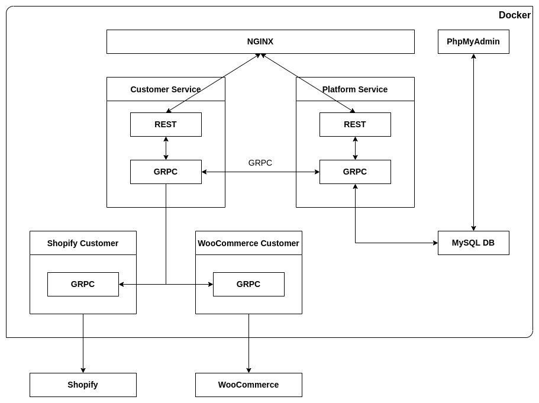

# Let's RUN with Ecommerce

## What to do
This assignment will help you apply the micro service architecture to develop a customer management gateway 
for two types of ecommerce platform which are **Shopify** and **WooCommerce**. There will be two main services named 
**Customer** and **Platform** which serve as an API gateway. **Platform** service will perform basic management features 
for a list of supported ecommerce platforms. Meanwhile, **Customer** services will connect and forward the API request 
to a designated platform. In order to establish a consensus in data structure, two services which represent 2 types of 
ecommerce platform are introduced. These services will function as a client to the REST API gateway of **Shopify** and 
**WooCommerce** as well as transform the platform specific data to the pre-defined structure.

### System architecture overview

  
### This assignment consists of 6 repositories
1. [Let's Run Docker](https://github.com/dinhtp/lets-run)
2. [Let's Run PbType](https://github.com/dinhtp/lets-run-pbtype)
3. [Customer Gateway Service](https://github.com/dinhtp/lets-run-customer)
4. [Platform Gateway Service](https://github.com/dinhtp/lets-run-platform)
5. [Shopify Customer Service](https://github.com/dinhtp/lets-run-shopify-customer)
6. [WooCommerce Customer Service](https://github.com/dinhtp/lets-run-woocommerce-customer)

##  Prerequisite
- Complete [Let's Go](https://github.com/dinhtp/lets-go) assignment.

## How to use
### Docker command
In order to speed up the processing of spinning up the services with in the `docker-compose.yml` file, 
a few shell scripts created to quickly get the LAN IP, bring up and down the docker services. 
It is also required to take a look inside those scripts to understand the logic behind each command.

During the first run or everytime your local machine LAN IP is changed, it is required to execute the `./start`
command before bring up the docker services. Usually, this command is executed only once during each active session.

- Run `./start` to populate the LAN IP to docker environment.
- Run `./up` to bring up all the services in the docker compose file.
- Run `./down` to bring down all the services in the docker compose file.

### RUN Rest Service
Each Rest service written and built by Golang will carry a domain name defined in the `nginx.conf` file.
With each domain name, it is required to update the `hosts` file so that your local machine forward the request correctly.
For Linux users, the `hosts` file is located at `/etc/hosts`.
For Windows users, the `hosts` file is located at `C:\Windows\System32\drivers\etc\hosts`.

- Update the service domain name in the `hosts` file. For example: `127.0.0.1 api-run-customer.local.com`
- To bring up all the services in the docker compose file, run `./up`
- Check if the service is up and running using `docker ps`

> NOTE: Changes in this repository ARE NOT REQUIRED to be committed into Github